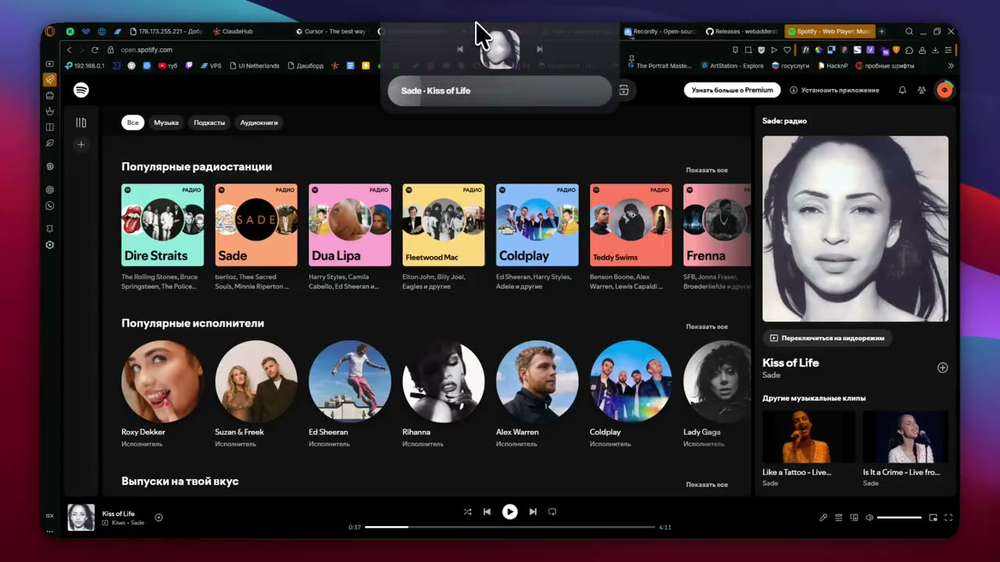

# Music Island

Windows top-edge media island. Works with any SMTC player; optional Direct mode for Yandex Music Desktop.

**0.9.8 · open beta** · Windows 10/11 · [GPL-3.0](LICENSE) · local-first · no telemetry

[](https://player.vimeo.com/video/1212924830?background=1&autoplay=1&muted=1&loop=1&title=0&byline=0&portrait=0&badge=0&controls=0)

<p align="center">
  <a href="https://player.vimeo.com/video/1212924830?background=1&autoplay=1&muted=1&loop=1&title=0&byline=0&portrait=0&badge=0&controls=0"><strong>▶ Watch preview</strong></a>
  ·
  <a href="https://vimeo.com/1212924830">Vimeo</a>
</p>

## Download

[GitHub Releases](https://github.com/redheadesign/music-island/releases) → `music-island.exe` (portable, unsigned — SmartScreen may warn).

## Features

- Hover island: artwork, title/artist, progress, play/pause, prev/next
- Settings: width, scale, open delay, SMTC source, Direct, autostart, **Ru / En**
- SMTC health + preferred source
- Opt-in Direct Yandex (like/dislike, wave chip, quick reload)
- Tray: settings / quit · config in `%APPDATA%\Music Island\`

## Limitations

- Direct is experimental (local CDP, may restart the client once, can break after Yandex updates)
- After long downtime use overlay **Quick reload** / Settings **Restart**
- Seek click/stutter is usually the player/SMTC, not a double-seek from Music Island
- SMTC capabilities vary by app

## Develop

Windows 10/11, WebView2, Node.js, Rust, MSVC Build Tools.

```powershell
npm install
npm run tauri:dev
npm run tauri:build   # → release/music-island.exe
```

Docs: [Architecture](docs/ARCHITECTURE.md) · [Media](docs/MEDIA_ARCHITECTURE.md) · [Direct](docs/YANDEX_MUSIC_API.md) · [Troubleshooting](docs/TROUBLESHOOTING.md) · [Releases](docs/RELEASES.md)

## Author

Telegram [@redheadesigner](https://t.me/redheadesigner) · contact [@redheadesign](https://t.me/redheadesign)

Unofficial project — not affiliated with Apple, Microsoft, Spotify, or Yandex.
