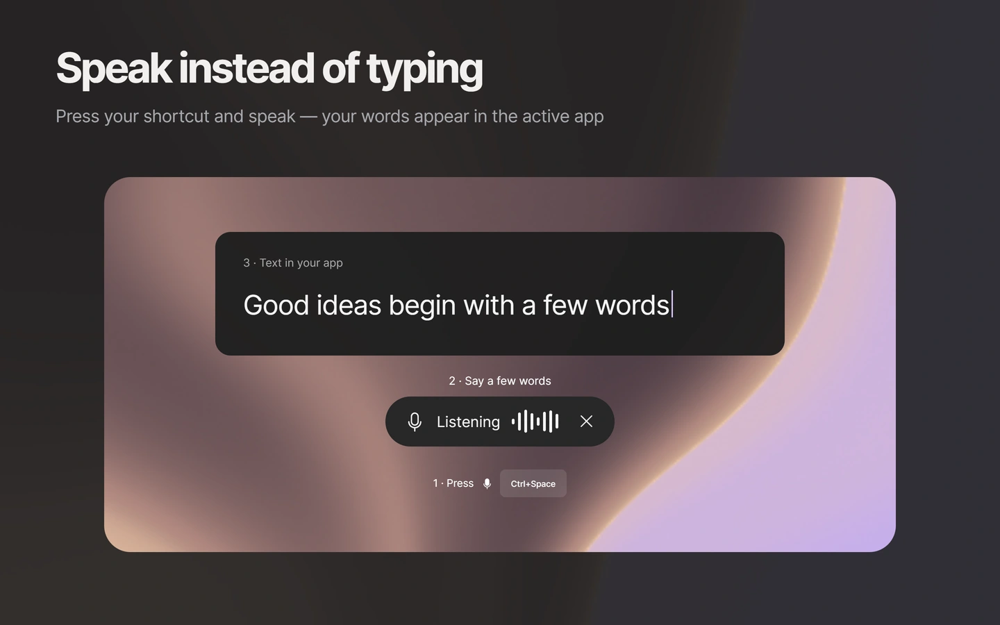
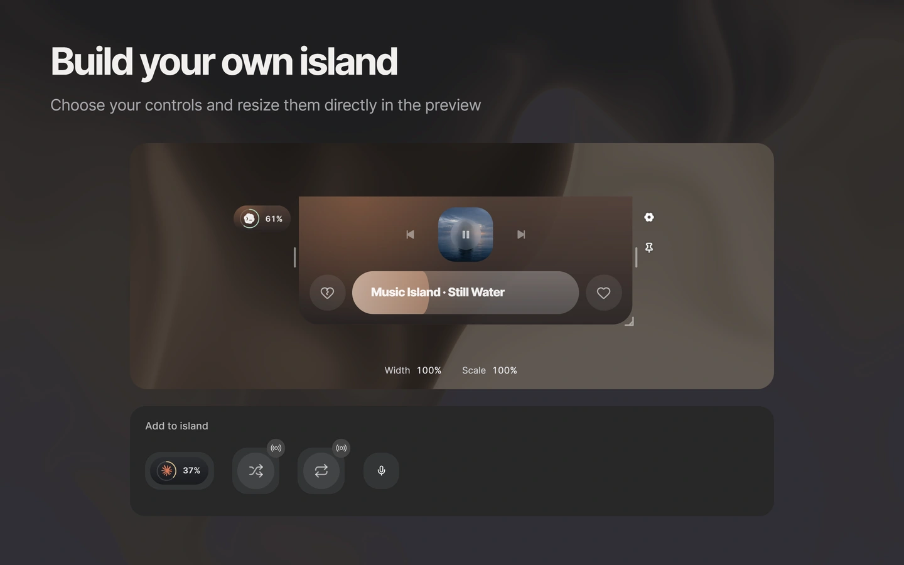
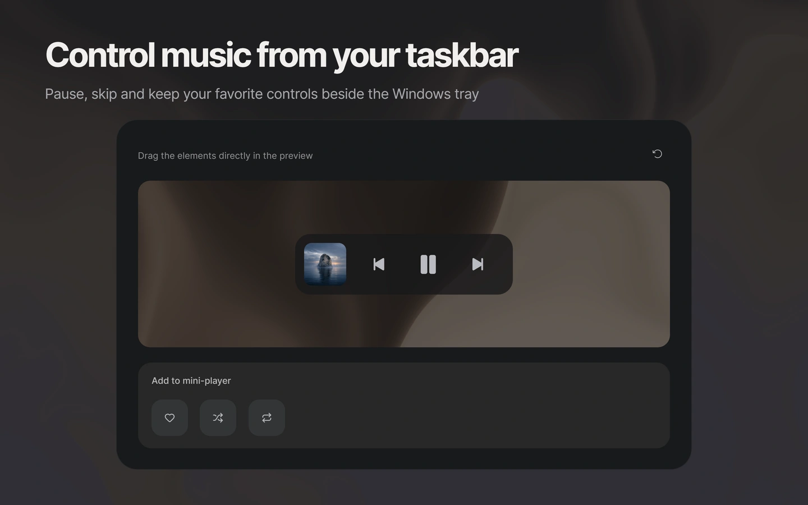
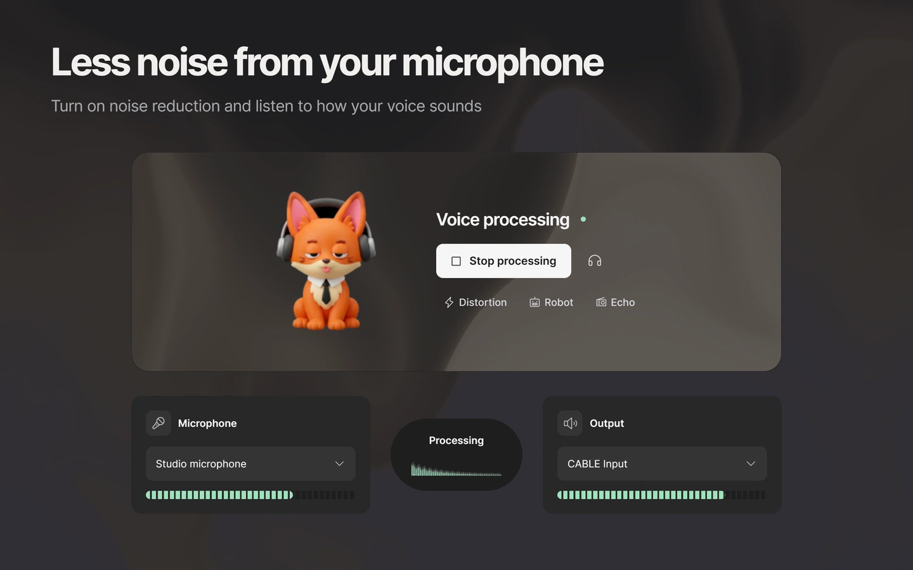
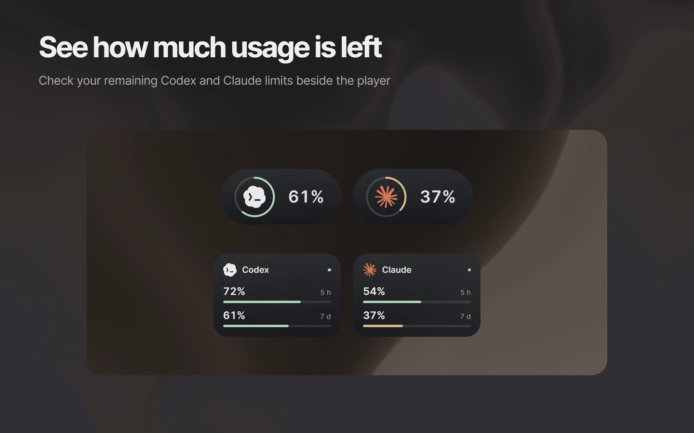
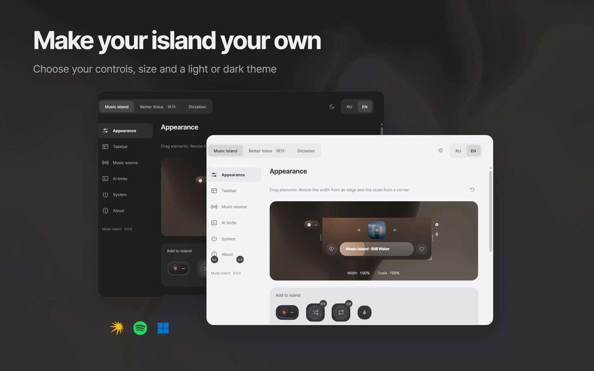
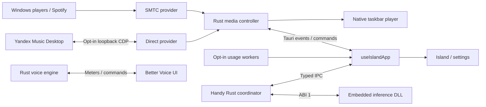

# Music Island

Control music from the top edge of your Windows desktop and type with your voice in the app you are using

**3.0.0** · Windows 10/11 · [GPL-3.0-or-later](LICENSE) · local-first · no telemetry

[**Download the latest published version**](https://github.com/redheadesign/music-island/releases/latest) · [What's new](CHANGELOG.md) · [Component workshop](docs/STORYBOOK.md)

https://github.com/user-attachments/assets/87c23079-ffd6-4856-96a2-23a88e987366

Download `music-island.exe`, save it in a folder you want to keep and open it — no installation is needed. Existing settings stay in `%APPDATA%\Music Island\`. The executable is unsigned; Windows may show SmartScreen. Portable updates require the release SHA-256 checksum and verify the PE before replacement. A checksum is an integrity check, not an Authenticode publisher signature. [Security details](SECURITY.md).



Press your shortcut, speak and finish the recording. Recognition runs on your computer; the result is inserted into the active app and can be kept with its audio in History. Download speech recognition for your language in Settings → Dictation, reuse files from Handy and manage your dictionary and optionally use **AI processing** through a provider you configure. Regular dictation stays local; provider processing is off by default and uses a separate shortcut.

Dictation is adapted from [Handy v0.9.7](https://github.com/cjpais/Handy/tree/v0.9.7), commit `05e0aedd2906f0d82722735f930465950c476b90` (CJ Pais, MIT). See [setup and storage](docs/DICTATION.md), the [adaptation and upgrade journal](docs/HANDY_ADAPTATIONS.md), and [third-party notices](THIRD_PARTY_NOTICES.md). Models have their own licenses. Downloaded files live under `%APPDATA%\Music Island\dictation\`; deleting the EXE does not remove them. Manage them in System → Data.



Drag real controls into the preview: artwork, transport, progress, reactions and assistant widgets. Put both reactions on either side. Pull an edge to change width or a corner to change scale. Settings and play/pause always remain accessible.

Choose the island's display in Appearance. Position follows display rotation and
resolution changes; reconnecting a preferred monitor restores the island there.



An optional native mini-player sits beside the Windows system tray and follows the taskbar as it appears and hides. Start with artwork and three playback buttons; add Like, Shuffle or Repeat, rearrange them and adjust their size. Available on the primary horizontal taskbar. [Details](docs/TASKBAR.md).



Clean up your microphone, hear the result and switch voice effects on or off. The signal route shows input, processing and output together. The fox and the warm graphite material respond to processing. Better Voice is **Beta**; routing audio into another app requires VB-Cable. [Setup and audio engine](docs/BETTER_VOICE.md).



Optional Codex and Claude widgets show remaining quota in compact rings or a detailed view. Choose their size and position, and whether they stay visible when the island closes. Each connection is off by default: Codex talks to the installed local app-server, while Claude uses the existing local Claude Code sign-in to query Anthropic directly. Screenshots use fictional data. [Connection and privacy details](docs/USAGE.md).



Graphite and light themes share the same controls, navigation and surfaces. A short introduction shows music, customization and voice, then offers Windows autostart explicitly. Choose Windows SMTC, the Spotify desktop app via SMTC, or an explicit Direct Yandex Music connection. Shuffle, Repeat and reactions are available where the selected player supports them.

## Media connections

**Windows SMTC** is the default. Music Island follows the selected Windows media session; Spotify works through its desktop app, without a separate Spotify API login.

**Direct Yandex Music** is an optional connection to the installed desktop client through a loopback-only CDP endpoint. Connect in Settings → Music source. The first connection may require restarting the client with your consent. This unofficial integration can change after a Yandex update; SMTC remains available as a separate choice. [Protocol details](docs/YANDEX_MUSIC_API.md).

**Assistant limits** are off by default and enabled separately. Codex runs the installed `codex.exe app-server` and relies on its existing login without reading its auth files. Claude reads the existing local Claude Code OAuth sign-in only after you enable it, then queries Anthropic directly without a Music Island proxy. Credentials are never returned to the interface or sent to Music Island servers. Stale or unavailable data is labelled rather than presented as a current limit. [Usage architecture](docs/USAGE.md).

## Architecture

React 19 + TypeScript + Vite render the island and settings; Tauri 2 and Rust own native media, windows, audio, usage connections and updates.



- **Shared:** types, tokens, material, UI primitives and configuration normalization.
- **App:** configuration, media, usage, dictation and window lifecycles behind `useIslandApp`.
- **Features:** island, settings, native-player preview, assistant widgets, Better Voice, dictation and onboarding.
- **Native:** provider arbitration, a Win32 taskbar host, audio engine, local configuration and checksum-verifying portable updater. No WebView is embedded in the taskbar.
- **Storybook:** production React components with isolated native mocks, including the scenes used for these screenshots.

[Architecture](docs/ARCHITECTURE.md) · [Media](docs/MEDIA_ARCHITECTURE.md) · [Better Voice](docs/BETTER_VOICE.md) · [Troubleshooting](docs/TROUBLESHOOTING.md) · [Third-party notices](THIRD_PARTY_NOTICES.md)

## Develop

Windows 10/11, WebView2, Node.js, Rust and MSVC Build Tools. Dictation additionally
needs the native dependencies and runtime bundle described in [Dictation build](docs/DICTATION.md#build).
Build that bundle and set `MUSIC_ISLAND_DICTATION_BUNDLE` before native development.
The portable build script prepares and embeds the bundle automatically.

```powershell
npm ci
npm run tauri:dev
npm run storybook       # http://127.0.0.1:6006
npm run tauri:build     # release/music-island.exe
```

Browser previews do not test native input, media sessions or the audio engine. Run the checks in [QA](docs/QA.md) and [Releases](docs/RELEASES.md) before distributing a build.

The [component workshop](docs/STORYBOOK.md) covers Foundations, Atoms, Molecules, Organisms and Screens. The six release scenes use production components and local sample data. [Release media](docs/RELEASES.md#30-preparation) includes three Russian Telegram cards, the retained 46-second RU/EN showreels, and two new Russian films: 40-second Continuous and 36-second Rhythm. [Motion production](docs/MOTION_PRODUCTION.md) documents sources, timelines and export; [Brand](docs/BRAND.md) defines standard, intro and portrait logo roles

## Author

Telegram [@redheadesigner](https://t.me/redheadesigner) · contact [@redheadesign](https://t.me/redheadesign)

Unofficial project. Not affiliated with Apple, Microsoft, OpenAI, Anthropic, Spotify or Yandex. Product names and logos belong to their respective owners.

## Dictation

Optional local dictation adapts Handy 0.9.7 inside Music Island. Download speech recognition for your language and choose a shortcut in Settings → Dictation. Models and recordings live in owned AppData storage; deleting the portable EXE does not remove them. [Dictation, build and cleanup](docs/DICTATION.md) · [Privacy](docs/PRIVACY.md) · [Upstream adaptations](docs/HANDY_ADAPTATIONS.md).

