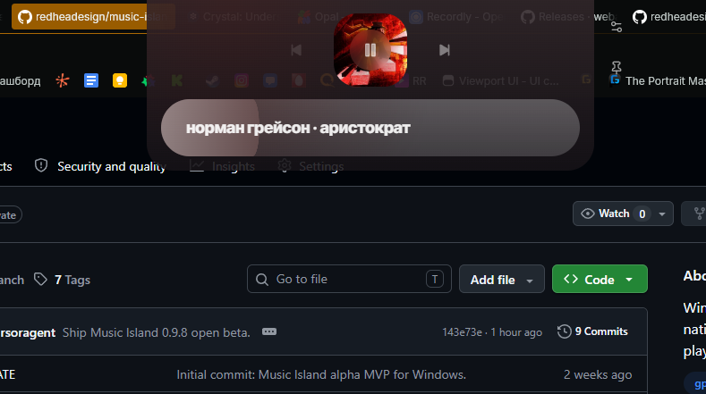
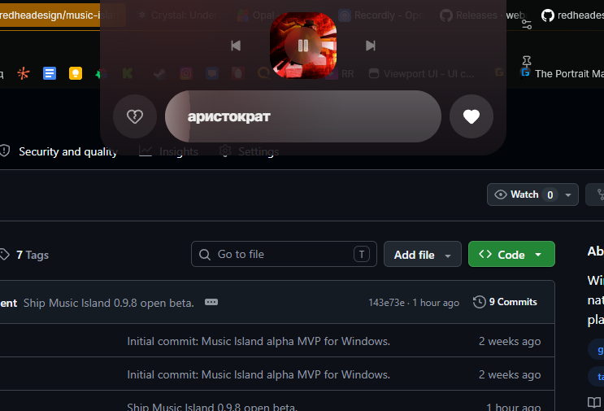
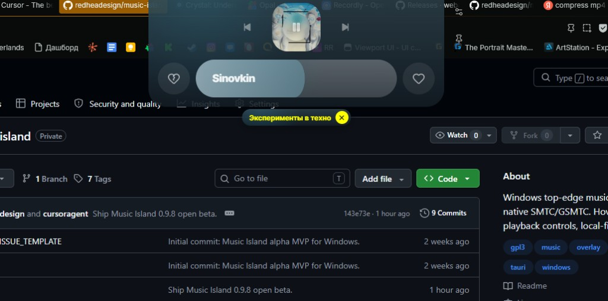

# Music Island

Windows top-edge media island. Works with any SMTC player; optional Direct mode for Yandex Music Desktop.

**0.9.8 · open beta** · Windows 10/11 · [GPL-3.0](LICENSE) · local-first · no telemetry

<video
  src="https://github.com/redheadesign/music-island/releases/download/v0.9.8/preview.mp4"
  poster="docs/media/preview-poster.jpg"
  controls
  playsinline
  preload="metadata"
  width="100%"
></video>

<p align="center"><a href="https://github.com/redheadesign/music-island/releases/download/v0.9.8/preview.mp4">Download preview (MP4)</a> · also in <a href="docs/media/preview.mp4"><code>docs/media/</code></a></p>

<p align="center">
  
  &nbsp;
  
</p>

<p align="center">
  
</p>

## Download

[GitHub Releases](https://github.com/redheadesign/music-island/releases) → `music-island.exe` (portable, unsigned — SmartScreen may warn).

## Features

- Hover island: artwork, title/artist, progress, play/pause, prev/next
- Settings: width, scale, open delay, SMTC source, Direct, autostart, **Ru / En**
- SMTC health + preferred source
- Opt-in Direct Yandex (like/dislike, wave chip, quick reload)
- Tray: settings / quit · config in `%APPDATA%\Music Island\`

## Limitations

- Direct is experimental (local CDP, may restart the client once, can break after Yandex updates)
- After long downtime use overlay **Quick reload** / Settings **Restart**
- Seek click/stutter is usually the player/SMTC, not a double-seek from Music Island
- SMTC capabilities vary by app

## Develop

Windows 10/11, WebView2, Node.js, Rust, MSVC Build Tools.

```powershell
npm install
npm run tauri:dev
npm run tauri:build   # → release/music-island.exe
```

Docs: [Architecture](docs/ARCHITECTURE.md) · [Media](docs/MEDIA_ARCHITECTURE.md) · [Direct](docs/YANDEX_MUSIC_API.md) · [Troubleshooting](docs/TROUBLESHOOTING.md) · [Releases](docs/RELEASES.md)

## Author

Telegram [@redheadesigner](https://t.me/redheadesigner) · contact [@redheadesign](https://t.me/redheadesign)

Unofficial project — not affiliated with Apple, Microsoft, Spotify, or Yandex.
