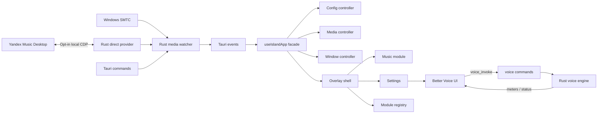

https://github.com/user-attachments/assets/28c65a1f-1fee-4ee0-a4f6-2fb89cf8c78e

# Music Island

Windows top-edge media island for any SMTC player, plus an optional **direct connection to the native Yandex Music desktop app** and built-in **Better Voice (Beta)** mic cleanup.

**1.3.22** · Windows 10/11 · [GPL-3.0](LICENSE) · local-first · no telemetry

## Download

[GitHub Releases](https://github.com/redheadesign/music-island/releases) → `music-island.exe` (portable; unsigned builds may trigger SmartScreen).

## Features

- Hover island: artwork, title/artist, progress, play/pause, prev/next
- **Windows SMTC** – works with Spotify, browsers, and other system media sessions
- **Direct Yandex Music** – opt-in link to the installed desktop client over a local debug endpoint (127.0.0.1): lower latency, like/dislike, active wave chip, seek, and quick reload when the client drops
- **Better Voice (Beta)** – in-process denoise / AGC / EQ / FX → virtual microphone (VB-Cable); fox mascot + in-app guide — see [`docs/BETTER_VOICE.md`](docs/BETTER_VOICE.md)
- Settings: Music Island / Better Voice scopes, accent color, width, scale, open delay, preferred SMTC source, protocol switch, autostart, **Ru / En**
- Portable updates from GitHub Releases (check on start + About → download/replace exe; Unicode-safe relaunch)
- Startup intro splash (skipped on Windows autostart)
- Tray: settings / quit · config in `%APPDATA%\Music Island\`

### Direct Yandex Music

In Settings → Music source, connect **Direct Yandex Music** (explicit consent). Music Island attaches to the already running desktop app when possible; the first connect may restart the client with a loopback-only CDP port. This is unofficial and can break after a Yandex client update – you can always switch back to SMTC.

## Architecture

Same layers as [`docs/ARCHITECTURE.md`](docs/ARCHITECTURE.md):



- **Native:** SMTC + Direct Yandex arbitration, window/tray, portable updater, in-process Better Voice engine, config under `%APPDATA%\Music Island\`
- **Frontend:** `useIslandApp` facade → overlay / music / settings; Better Voice UI under Settings scope; shared glass UI + i18n

More detail: [`docs/ARCHITECTURE.md`](docs/ARCHITECTURE.md) · [`docs/MEDIA_ARCHITECTURE.md`](docs/MEDIA_ARCHITECTURE.md) · [`docs/YANDEX_MUSIC_API.md`](docs/YANDEX_MUSIC_API.md) · [`docs/BETTER_VOICE.md`](docs/BETTER_VOICE.md) · [`docs/TROUBLESHOOTING.md`](docs/TROUBLESHOOTING.md) · [`CHANGELOG.md`](CHANGELOG.md)

## Limitations

- **Better Voice** is Beta (UI/onboarding still evolving; needs VB-Cable)
- Direct is experimental (local CDP, may restart the client once, can break after Yandex updates)
- After long downtime use overlay **Quick reload** / Settings **Restart**
- Seek click/stutter is usually the player/SMTC, not a double-seek from Music Island
- SMTC capabilities vary by app
- Portable exe may be unsigned (SmartScreen)

## Develop

Windows 10/11, WebView2, Node.js, Rust, MSVC Build Tools.

```powershell
npm install
npm run tauri:dev
npm run tauri:build   # → release/music-island.exe
```

## Author

Telegram [@redheadesigner](https://t.me/redheadesigner) · contact [@redheadesign](https://t.me/redheadesign)

Unofficial project – not affiliated with Apple, Microsoft, Spotify, or Yandex.
