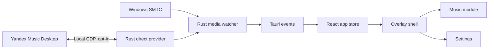

# Music Island

Windows top-edge media controller with a compact “island” UI. It works with any player registered in Windows SMTC and offers an explicit opt-in direct connection to Yandex Music Desktop.

> **Status:** 0.9.5 beta · Windows 10/11 · local-first · no telemetry

## Highlights

- Hover-reveal island at the top center of the screen
- Live track metadata, artwork, progress, play/pause, previous/next
- Live width, scale and open-delay controls in a focused glass settings UI
- Stable multi-session arbitration, preferred-source selection and SMTC health diagnostics
- Automatic SMTC backoff when the Windows broker is degraded or unavailable
- Experimental low-latency Yandex Music Desktop control with like/dislike state
- Active My Wave selection chip (optional wave carousel planned later)
- Portable “launch with Windows” that refreshes the exe path after moves
- Authoritative provider routing: Direct and SMTC health never overwrite each other's playback state
- System tray shortcuts for settings, update checks and quit
- Settings stored locally in `%APPDATA%\Music Island\`

## Download

Download the latest build from [GitHub Releases](https://github.com/redheadesign/music-island/releases) — **v0.9.5 beta**.

- `music-island.exe` is a portable Windows executable; no installer is required.

The build is currently unsigned and can trigger Windows SmartScreen until Authenticode signing is set up.

## Known limitations

- **Direct Yandex connection is experimental** — first connection may restart the installed desktop client with a random loopback-only CDP port after explicit confirmation. Later launches reattach to the validated endpoint without restarting the client. Desktop client updates can change its internal controls; switch to Windows SMTC explicitly if needed.
- **Direct can break on non-home Yandex routes** — metadata and commands may stop working after navigating to Collection or other pages until the home surface (or a protocol restart) restores the expected DOM. Tracked in GitHub issues.
- **Long downtime can leave Direct degraded** — if Yandex Music was closed for a long time, use **Перезапустить** in Settings. Automatic recovery is incomplete.
- **Seek audio spike** — a brief click or stutter when scrubbing the timeline is common with Windows SMTC/GSMTC. Music Island sends a single seek command; the artifact usually comes from the media player re-buffering after `PlaybackPositionChangeRequested` (Electron/Chromium apps, Spotify desktop, and others). Compare with the native Windows media flyout on the same track — if it sounds the same, it is a protocol/player limitation, not a duplicate command from this app.
- **SMTC is a lowest-common-denominator API** — not every player exposes every command; behavior varies by app.

## Quick start (development)

**Requirements:** Windows 10/11, WebView2, Node.js, Rust, MSVC Build Tools.

```powershell
npm install
npm run dev          # browser preview with demo data
npm run tauri:dev    # native SMTC integration
npm run tauri:build  # release build → copied to release/
```

```powershell
npm run test
npm run lint
npm run build
```

## Architecture



Details: [`docs/ARCHITECTURE.md`](docs/ARCHITECTURE.md) · [`docs/MEDIA_ARCHITECTURE.md`](docs/MEDIA_ARCHITECTURE.md) · [`docs/YANDEX_MUSIC_API.md`](docs/YANDEX_MUSIC_API.md) · [`docs/PERFORMANCE.md`](docs/PERFORMANCE.md) · [`docs/TROUBLESHOOTING.md`](docs/TROUBLESHOOTING.md)

## Support & author

- **Telegram channel (Russian):** [@redheadesigner](https://t.me/redheadesigner) — updates, design notes, dev log
- **Contact:** [@redheadesign](https://t.me/redheadesign) — Russian & English

## License

[GNU General Public License v3.0](LICENSE) (GPL-3.0).

You may use, study, modify, and share this project under GPL terms. Donations are welcome but do not change your rights or obligations under the license. If you distribute modified versions, you must provide corresponding source under the same license.

## Privacy

No telemetry by default. Settings and logs stay on your machine. Direct integration communicates only with the local desktop client through `127.0.0.1`.

## Disclaimer

Unofficial community project. Not affiliated with Apple, Microsoft, Spotify, Yandex, or any music streaming service.
