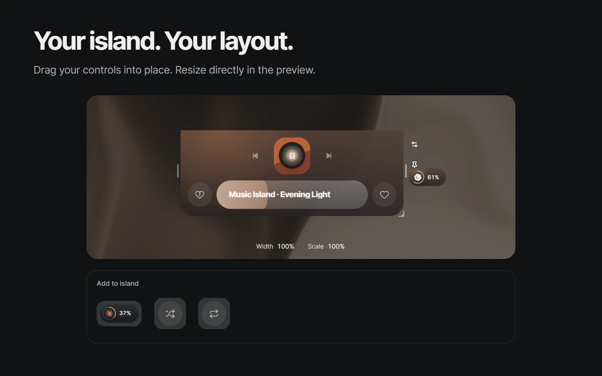
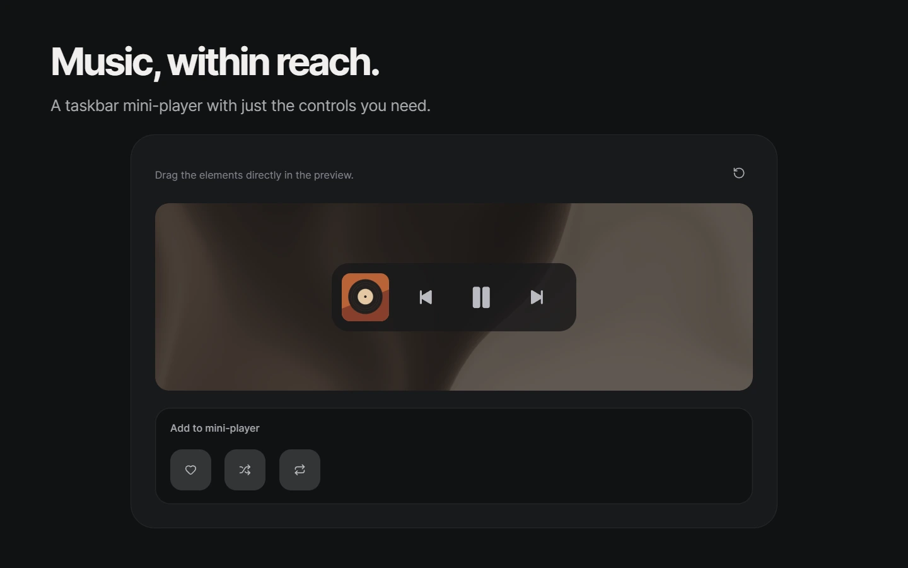
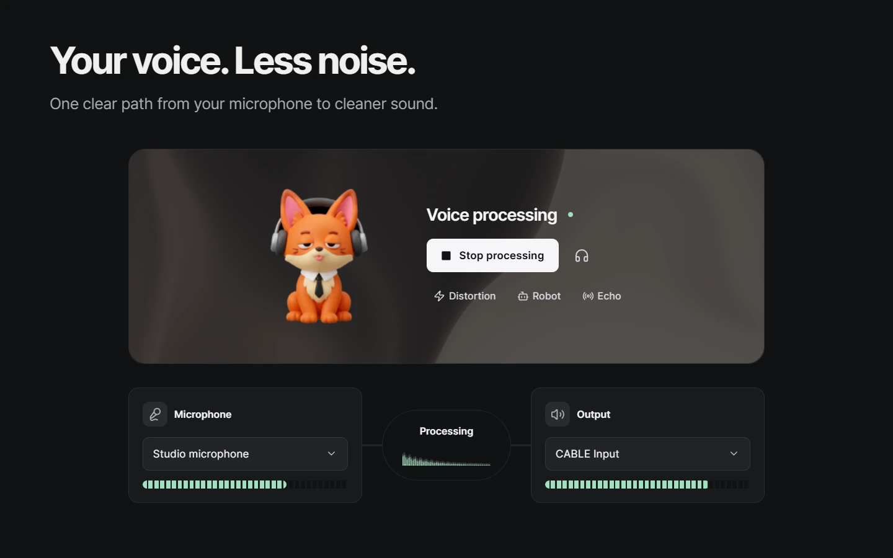
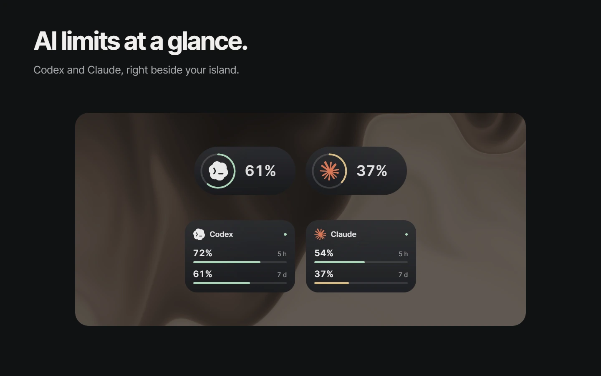
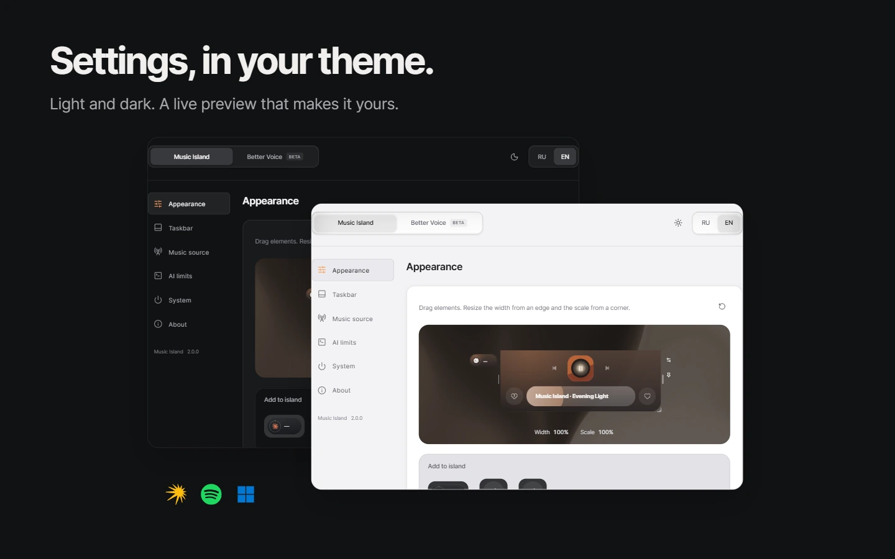
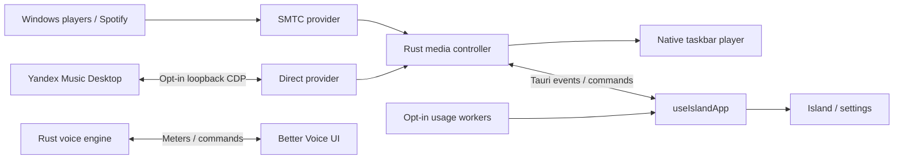

https://github.com/user-attachments/assets/28c65a1f-1fee-4ee0-a4f6-2fb89cf8c78e

# Music Island

Music, voice and assistant limits — a compact workspace at the edge of your Windows desktop.

**2.0.0** · Windows 10/11 · [GPL-3.0-or-later](LICENSE) · local-first · no telemetry

[**Download Music Island 2.0**](https://github.com/redheadesign/music-island/releases/tag/v2.0.0) · [What's new](CHANGELOG.md) · [Component workshop](docs/STORYBOOK.md)

Portable: download `music-island.exe` and run it. Existing settings stay in `%APPDATA%\Music Island\`. The executable is unsigned; Windows may show SmartScreen.



Drag real controls into the preview: artwork, transport, progress, reactions and assistant widgets. Put both reactions on either side. Pull an edge to change width or a corner to change scale. Settings and play/pause always remain accessible.



An optional native mini-player sits beside the Windows system tray and follows the taskbar as it appears and hides. Start with artwork and three playback buttons; add Like, Shuffle or Repeat, rearrange them and adjust their size. Available on the primary horizontal taskbar. [Details](docs/TASKBAR.md).



Clean up your microphone, hear the result and switch voice effects on or off. The signal route shows input, processing and output together. The fox and the warm graphite material respond to processing. Better Voice is **Beta**; routing audio into another app requires VB-Cable. [Setup and audio engine](docs/BETTER_VOICE.md).



Optional Codex and Claude widgets show remaining quota in compact rings or a detailed view. Choose their size and position, and whether they stay visible when the island closes. Each connection is off by default: Codex talks to the installed local app-server, while Claude uses the existing local Claude Code sign-in to query Anthropic directly. Screenshots use fictional data. [Connection and privacy details](docs/USAGE.md).



Light and dark themes, live previews and consistent controls. Choose Windows SMTC, the Spotify desktop app via SMTC, or an explicit Direct Yandex Music connection. Shuffle, Repeat and reactions are available where the selected player supports them.

## Media connections

**Windows SMTC** is the default. Music Island follows the selected Windows media session; Spotify works through its desktop app, without a separate Spotify API login.

**Direct Yandex Music** is an optional connection to the installed desktop client through a loopback-only CDP endpoint. Connect in Settings → Music source. The first connection may require restarting the client with your consent. This unofficial integration can change after a Yandex update; SMTC remains available as a separate choice. [Protocol details](docs/YANDEX_MUSIC_API.md).

**Assistant limits** are off by default and enabled separately. Codex runs the installed `codex.exe app-server` and relies on its existing login without reading its auth files. Claude reads the existing local Claude Code OAuth sign-in only after you enable it, then queries Anthropic directly without a Music Island proxy. Credentials are never returned to the interface or sent to Music Island servers. Stale or unavailable data is labelled rather than presented as a current limit. [Usage architecture](docs/USAGE.md).

## Architecture

React 19 + TypeScript + Vite render the island and settings; Tauri 2 and Rust own native media, windows, audio, usage connections and updates.



- **Shared:** types, tokens, material, UI primitives and configuration normalization.
- **App:** configuration, media, usage and window lifecycles behind `useIslandApp`.
- **Features:** island, settings, native-player preview, assistant widgets and Better Voice.
- **Native:** provider arbitration, a Win32 taskbar host, audio engine, local configuration and checksum-verifying portable updater. No WebView is embedded in the taskbar.
- **Storybook:** production React components with isolated native mocks, including the scenes used for these screenshots.

[Architecture](docs/ARCHITECTURE.md) · [Media](docs/MEDIA_ARCHITECTURE.md) · [Better Voice](docs/BETTER_VOICE.md) · [Troubleshooting](docs/TROUBLESHOOTING.md) · [Third-party notices](THIRD_PARTY_NOTICES.md)

## Develop

Windows 10/11, WebView2, Node.js, Rust and MSVC Build Tools.

```powershell
npm ci
npm run tauri:dev
npm run storybook       # http://127.0.0.1:6006
npm run tauri:build     # release/music-island.exe
```

Browser previews do not test native input, media sessions or the audio engine. Run the checks in [QA](docs/QA.md) and [Releases](docs/RELEASES.md) before distributing a build.

The [component workshop](docs/STORYBOOK.md) covers Foundations, Atoms, Molecules, Organisms and Screens. The five release scenes use production components and local sample data; their [capture files](docs/releases/2.0/README.md) also include portrait images for Telegram.

## Author

Telegram [@redheadesigner](https://t.me/redheadesigner) · contact [@redheadesign](https://t.me/redheadesign)

Unofficial project. Not affiliated with Apple, Microsoft, OpenAI, Anthropic, Spotify or Yandex. Product names and logos belong to their respective owners.
