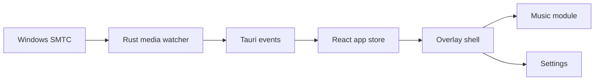

# Music Island

Windows top-edge overlay for the active media session — metadata, playback controls, and a compact “island” UI driven by native SMTC/GSMTC. Works with any desktop player that registers with Windows media controls (Spotify, browser players, desktop streaming apps, and others).

> **Status:** alpha MVP · Windows 10/11 · local-first · no telemetry by default

## Highlights

- Hover-reveal island at the top center of the screen
- Live track metadata, artwork, progress, play/pause, previous/next
- Layout presets: Clean Controls, Album Pill, Now Playing Rich, Focus Mode
- Themes, opacity, blur, scale, reduced motion, pin-expanded mode
- System tray: show/hide, settings, update check, reset position
- Settings stored locally in `%APPDATA%\Music Island\`
- Extensible shell for future modules (notes, todos, transcription)

## Download

Pre-built installers: [GitHub Releases](https://github.com/redheadesign/music-island/releases) — latest **v0.8.0** (alpha, private).

- **Recommended:** `Music Island_x.y.z_x64-setup.exe` (NSIS)
- **Optional:** `.msi` bundles

Unsigned alpha builds may trigger Windows SmartScreen until Authenticode signing is set up.

## Quick start (development)

**Requirements:** Windows 10/11, WebView2, Node.js, Rust, MSVC Build Tools.

```powershell
npm install
npm run dev          # browser preview with demo data
npm run tauri:dev    # native SMTC integration
npm run tauri:build  # release build → copied to release/
```

```powershell
npm run test
npm run lint
npm run build
```

## Architecture



Details: [`docs/ARCHITECTURE.md`](docs/ARCHITECTURE.md) · [`docs/TROUBLESHOOTING.md`](docs/TROUBLESHOOTING.md) · [`docs/ROADMAP.md`](docs/ROADMAP.md)

## Support & author

- **Telegram channel (Russian):** [@redheadesigner](https://t.me/redheadesigner) — updates, design notes, dev log
- **Contact:** [@redheadesign](https://t.me/redheadesign) — Russian & English

## License

[GNU General Public License v3.0](LICENSE) (GPL-3.0).

You may use, study, modify, and share this project under GPL terms. Donations are welcome but do not change your rights or obligations under the license. If you distribute modified versions, you must provide corresponding source under the same license.

## Privacy

No telemetry by default. Settings and logs stay on your machine.

## Disclaimer

Unofficial community project. Not affiliated with Apple, Microsoft, Spotify, or any music streaming service. Uses public Windows media session APIs only.
