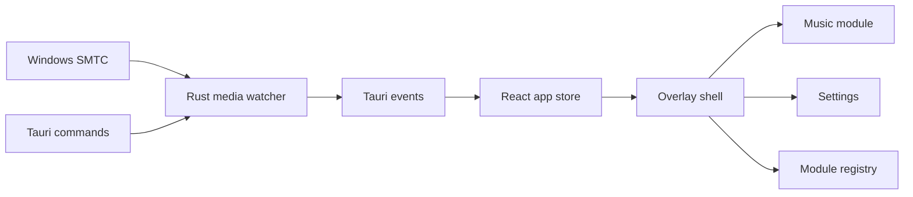

# Architecture

## Layers

## Native Layer

- `src-tauri/src/media`: reads Windows `GlobalSystemMediaTransportControlsSessionManager`, exposes snapshots and playback commands.
- `src-tauri/src/config`: versioned JSON config in app data.
- `src-tauri/src/window`: top-center positioning, reset position and always-on-top behavior.
- `src-tauri/src/tray`: tray menu and recovery actions.
- `src-tauri/src/updater`: reserved updater command until signed releases exist.
- `src-tauri/src/diagnostics`: support payload for GitHub issues.

## Frontend Layer

- `src/app`: app state, Tauri API wrapper and local progress interpolation.
- `src/features/overlay`: top-edge shell, hover states and animation orchestration.
- `src/features/music`: first built-in module.
- `src/features/settings`: user customization UI.
- `src/features/modules`: module contract and reserved future modules.
- `src/shared`: UI primitives, formatting and tokens.

## State Model

Overlay modes: `idle`, `peek`, `compact`, `expanded`, `pinned`, `settings`, `no-session`.

Native events are intentionally low frequency. The UI interpolates progress locally while playback is active, avoiding unnecessary native-to-webview chatter.

## Module Contract

Modules are expected to provide an id, title, icon, default layout, compact renderer, expanded renderer and command list. The shell owns positioning, settings and lifecycle; modules own their content.
