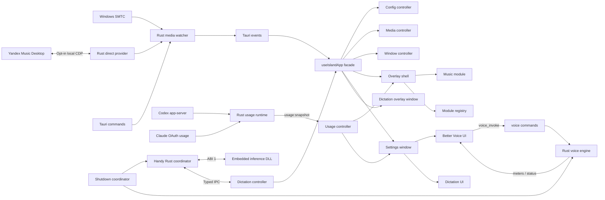

# Architecture

## Layers

## Native Layer

- `src-tauri/src/autostart`: portable Windows Run-key helper with quoted paths and single-entry refresh.
- `src-tauri/src/media`: provider arbitration, Windows `GlobalSystemMediaTransportControlsSessionManager`, health/backoff state and normalized snapshots/commands.
- `src-tauri/src/yandex`: explicit opt-in CDP discovery, renderer validation and a fixed command/state adapter for the installed desktop client.
- `src-tauri/src/config`: schema-versioned JSON config in `%APPDATA%\Music Island`.
- `src-tauri/src/window`: top-center bounds, native cursor gesture watcher, click-through state, settings / intro / already-running window lifecycle.
- `src-tauri/src/window/taskbar`: opt-in same-process Win32 player attached to the primary taskbar. A layered `STATIC` host and owner-drawn `BUTTON` children use buffered diff painting and direct native input; the supportedOS manifest keeps layered child behavior available. It measures occupied space, uses parent-relative placement, inherits taskbar movement/clipping and recreates on Explorer or DPI changes. It never injects into or resizes Explorer.
- `src-tauri/src/tray`: settings and quit actions; exit is routed through `shutdown`.
- `src-tauri/src/shutdown`: one idempotent shutdown coordinator shared by tray, updater and cleanup. It stops dictation and Better Voice off the Windows event loop, with an 8s worker deadline and 2s final process-exit fallback.
- `src-tauri/crates/handy-core`: lazy native dictation plugin; metadata/history access does not load the inference DLL or open the microphone. Activation, model management, audio capture, insertion and shutdown remain native.
- `src-tauri/crates/dictation-runtime` and `dictation-protocol`: embedded inference/VAD DLL and versioned C ABI. Extracted files are content-addressed and verified before absolute-path loading.
- `src-tauri/src/logging`: local startup, protocol-health and direct-provider diagnostics.
- `src-tauri/src/usage`: opt-in Codex and Claude quota probes, one generation-guarded polling task per enabled provider, backoff-aware retries and the shared native snapshot used by every window. Codex talks to the installed official `codex.exe app-server`; provider credentials are never returned to React.
- `src-tauri/src/updater`: **portable GitHub Releases updater** — check latest release, download `music-island.exe` plus required `SHA256.txt`, SHA-256 and PE sanity checks, replace running exe and relaunch. This is the intended forever update channel (always portable).
- `src-tauri/src/voice`: in-process Better Voice engine (capture → DSP/denoise → virtual route / VB-Cable), asset extract to `%APPDATA%\Music Island\voice\`, meters IPC.
- `src-tauri/src/plugins`: optional sidecar plugin discovery/host (legacy path; Better Voice ships in-process).
- `src-tauri/src/diagnostics`: support payload for GitHub issues.

## Frontend Layer

- `src/app/useIslandApp.ts`: stable typed facade consumed by feature UI. It composes controllers without exposing their ownership details.
- `src/app/config`: configuration loading, change subscription and persistence. Autostart is synchronized from the Rust save/startup path for portable path refresh.
- `src/app/media`: media snapshot/timeline subscriptions, local progress interpolation, session discovery, command dispatch and wave-chip state (catalog carousel disabled).
- `src/app/window`: settings-window and overlay action lifecycle.
- `src/app/dictation`: revision/session-guarded metadata, status, models, download progress and cursor-paged history behind the public facade. Native events are subscribed before initial cache reads; disabling rejects late active-session completions.
- `src/app/usage`: the shared usage snapshot adapter and controller. A window registers `usage:snapshot` before reading the native cache, so a provider transition during startup cannot be missed; revision guards reject late initial reads.
- `src/app/tauriApi.ts`: the frontend's native adapter; native command/event details stop here.
- `src/features/overlay`: top-edge shell, native gesture events, hit-tested action controls, island update nag, animation orchestration.
- `src/features/music`: capability-driven playback, timeline and direct-provider reaction controls; optional wave chip UI.
- `src/features/taskbar`: the React reference presentation used by the taskbar layout editor and Storybook. The actual Windows taskbar player is the native renderer described above; both consume the same ordered layout and capability-driven command contract.
- `src/features/settings`: live-saved layout controls, protocol health/status, Direct reconnect/consent, assistant usage opt-ins, About/updater UI, Music Island | Better Voice | Dictation scope switch and production `SettingsWindow` scroll shell. `IslandPreview` renders the production music controls and usage chips inside a scaled desktop inset; `TaskbarLayoutEditor` renders the shared React taskbar presentation. Preview callbacks are inert and never simulate native media or window behavior.
- `src/features/plugins/voice`: Better Voice settings, guide page, fox mascot, meters.
- `src/features/intro`: onboarding/startup coordinator in the `intro` window. Native launch snapshots and replay events carry generations; replay reuses the window, and stale close/finish commands are ignored.
- `src/features/dictation`: settings and nonactivating recording overlay; consumes the app facade and shared auxiliary controls.
- `src/features/notice`: already-running notice window.
- `src/features/modules`: module contract and reserved future modules.
- `src/shared`: scoped tokens, shared settings controls/navigation/selects/icons, island material and press feedback, i18n, `uiPrefs` and formatting. See [design-system ownership](DESIGN_SYSTEM.md).

Dependencies point inward: `shared` does not import app or feature code, `app` does not import feature UI, and features consume app-owned state through `useIslandApp`. A lightweight check in `scripts/check-import-boundaries.mjs` enforces these constraints as part of `npm run lint`. Feature-specific native interactions may use `tauriApi` until they become facade responsibilities.

## State Model

The overlay interaction phase is `collapsed`, `opening`, `open` or `closing`.
A generation invalidates stale async bounds/show completions, including work resumed
after a frame. Visibility derives from phase rather than a second boolean. Native
bounds commands also carry monotonic generations. Closing/opening deadlines recover
the gesture strip if an animation callback or native completion is missed; pinning
and media availability are separate state, not extra visibility owners.

The normalized `MediaSnapshot` identifies its provider (`smtc` or `yandex-direct`) and carries capability flags, timeline data, artwork, reaction state and SMTC health. The frontend does not need provider-specific command logic.

The watcher caches each authoritative snapshot, including timeline-only updates and cleared sessions. A newly opened media window reads this cache instead of starting another Windows probe. Provider and preferred-source generations invalidate older entries; concurrent first reads share initialization.

Native events are intentionally low frequency. Timeline events are compact and the UI interpolates progress locally while playback is active. The hidden Settings WebView has no media subscription or progress timer. SMTC uses active, idle, degraded and unavailable polling intervals; metadata and artwork are not re-read on every timeline probe.

The facade preserves one public state contract for both overlay and Settings windows. Passing `mediaEnabled: false` keeps the Settings WebView out of media snapshot/timeline subscriptions while retaining config, health and source-discovery behavior.

History uses the Handy SQLite schema with tested migrations, a bounded busy timeout
and cursor paging. Audio filenames are validated at the manager boundary; traversal
and symlink/reparse reads/deletes are rejected. Service secrets use current-user DPAPI
and do not cross the React snapshot boundary. App settings and dictation preferences
remain separate owned stores, rather than a browser database.

UI preferences for banners/snooze/dev previews live under `config.plugins.settings.ui` (`uiPrefs`).

Island layout and taskbar layout are normalized persisted models. The island editor supports ordered controls, reactions, usage providers and actions with required-element and no-duplicate guards. Width and scale use a local pointer draft and are saved only when the gesture commits. The native taskbar consumes its own ordered layout, keeps transport mandatory and guards every dispatch with the latest provider capabilities.

## Provider lifecycle

Windows SMTC is the default provider. The configured provider is authoritative: a Direct timeout retains the last Direct state and never injects SMTC playback or commands. The inactive provider may update only independent health shown in Settings/diagnostics.

Direct Yandex is enabled only after user confirmation. Music Island first reattaches to a validated running process and loopback endpoint. Only an explicit connection action may restart the installed Electron client with a random `127.0.0.1` debugging port. A serialized actor keeps one CDP WebSocket open for state and commands. Returning to SMTC closes the debug-enabled process and launches it normally after an explicit user action.

The direct provider uses fixed selectors and commands only. It never accepts arbitrary JavaScript from the frontend, stores account tokens or creates a second playback session.

## Schedulers and lifecycle

- The media watcher is the single owner of provider polling. It uses separate active, idle, degraded, unavailable and passive-SMTC intervals, publishes compact timeline events and keeps metadata reads out of timeline-only ticks.
- The taskbar worker coalesces refresh and placement requests, reuses cached media snapshots and bounds slower UI Automation scans behind a native geometry fast path. Artwork decoding is cancellable, revision-checked and limited to one blocking decode at a time.
- Each enabled usage provider owns one cancellable generation. Successful probes return to the five-minute interval; transient failures retry when their shorter backoff expires, rate limits retain the longer backoff, and an explicit Refresh may bypass automatic backoff. Disabling or reconnecting a provider invalidates late results.
- React controllers clean up delayed native subscriptions after unmount. The Settings window disables media and timeline work; the taskbar path has no React timeline timer; the main window alone owns overlay window events.

## Better Voice

Better Voice runs **inside** the Music Island process (not a required sidecar). Settings expose a Beta-scoped panel. Audio needs a Windows virtual cable (VB-Cable) so other apps can pick the processed mic. See [`BETTER_VOICE.md`](BETTER_VOICE.md).

## Module Contract

Modules are expected to provide an id, title, icon, default layout, compact renderer, expanded renderer and command list. The shell owns positioning, settings and lifecycle; modules own their content.

## Dictation and auxiliary UI

The `handy-core` native plugin owns dictation coordination, capture, models, history, shortcuts and insertion. Heavy inference is an embedded, extracted in-process DLL behind ABI 1; it is neither a sidecar application nor JavaScript recognition. The `app/dictation` controllers remain behind `useIslandApp`; feature UI stays in `features/dictation`. [Boundary and packaging](DICTATION.md), [upstream changes](HANDY_ADAPTATIONS.md), [scoped design tokens](DESIGN_SYSTEM.md).

Native media events carry provider/command generation and track identity. Navigation/seek invalidates in-flight probes; metadata is read before its timeline. React rejects old generations and track-mismatched timeline updates and binds optimistic seek state to track/source/command generation.

## Release 3 UI and launch contracts

The model catalog lives in the dictation feature: locale changes recommendation/filter policy only. `DictationModels` coordinates actions and dialogs; `ModelCard` is the reusable rendering component. Shared `ActionMenu` reuses Select's portal, placement and keyboard implementation. Production imports never point to release scenes or mocks.

`get_launch_state` includes the current executable path. `finish_onboarding(generation, enableAutostart?)` preserves the launch-generation guard and performs registration outside the Windows event loop. Only an explicit true enables startup; omission preserves the preference. Registration/save failures return an error and restore the prior autostart preference where possible. Existing profiles and `--startup` do not open the introduction.

The preview camera uses a transform with a measured layout footprint. Drag hit-testing and copy placement use viewport coordinates. The portal copy freezes computed appearance before leaving ancestor selectors and inherited tokens.

Both island and taskbar editors use `LayoutDragGhost` / `dragGeometry`, one pointer
path, cancellation and a separate keyboard path. No browser HTML5 drag image is
allowed to compete with the measured portal copy.

`window/monitors.rs` owns display enumeration, stable Windows device identity,
preferred/primary fallback and physical geometry. Display, DPI and device messages
invalidate the snapshot; the existing gesture watcher refreshes it independently
of cursor entry, with a two-second recovery poll. Disconnecting a preferred display
temporarily uses primary without erasing the preference. Intro follows the island.
The initial main HWND is hidden; `useOverlayReady` acknowledges the settled,
configured WebView viewport before native show, preventing a default-size flash.
The settings command always shows/unminimizes and focuses the existing window.
It is not a visibility toggle.

Release images and the seekable 46-second motion scenes live only in Storybook. A loopback receiver accepts PNGs from the fixed Storybook origin into allowlisted artifact paths. FFmpeg/Sharp are development tools and are not bundled into Music Island.

`shared/ui/AppLogo` uses the canonical `assets/app-icon.svg`; onboarding, the launch
animation, About and release scenes share it. The icon generator derives PNG/ICO
from that source. Static brand assets are the only root-asset dependency accepted
by the shared import boundary (no app or feature modules).
