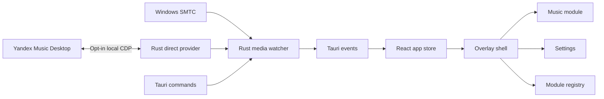

# Architecture

## Layers

## Native Layer

- `src-tauri/src/media`: provider arbitration, Windows `GlobalSystemMediaTransportControlsSessionManager`, health/backoff state and normalized snapshots/commands.
- `src-tauri/src/yandex`: explicit opt-in CDP discovery, renderer validation and a fixed command/state adapter for the installed desktop client.
- `src-tauri/src/config`: schema-versioned JSON config in `%APPDATA%\Music Island`.
- `src-tauri/src/window`: top-center bounds, native cursor gesture watcher, click-through state and settings-window lifecycle.
- `src-tauri/src/tray`: settings, update-check and quit actions.
- `src-tauri/src/logging`: local startup, protocol-health and direct-provider diagnostics.
- `src-tauri/src/updater`: reserved updater command until signed releases exist.
- `src-tauri/src/diagnostics`: support payload for GitHub issues.

## Frontend Layer

- `src/app`: app state, Tauri API wrapper and local progress interpolation.
- `src/features/overlay`: top-edge shell, native gesture events, hit-tested action controls and animation orchestration.
- `src/features/music`: capability-driven playback, timeline and direct-provider reaction controls.
- `src/features/settings`: live-saved layout controls, protocol health/status and direct-connection consent.
- `src/features/modules`: module contract and reserved future modules.
- `src/shared`: UI primitives, formatting and tokens.

## State Model

Overlay modes: `idle`, `peek`, `compact`, `expanded`, `pinned`, `settings`, `no-session`.

The normalized `MediaSnapshot` identifies its provider (`smtc` or `yandex-direct`) and carries capability flags, timeline data, artwork, reaction state and SMTC health. The frontend does not need provider-specific command logic.

Native events are intentionally low frequency. Timeline events are compact and the UI interpolates progress locally while playback is active. The hidden Settings WebView has no media subscription or progress timer. SMTC uses active, idle, degraded and unavailable polling intervals; metadata and artwork are not re-read on every timeline probe.

## Provider lifecycle

Windows SMTC is the default provider. The configured provider is authoritative: a Direct timeout retains the last Direct state and never injects SMTC playback or commands. The inactive provider may update only independent health shown in Settings/diagnostics.

Direct Yandex is enabled only after user confirmation. Music Island first reattaches to a validated running process and loopback endpoint. Only an explicit connection action may restart the installed Electron client with a random `127.0.0.1` debugging port. A serialized actor keeps one CDP WebSocket open for state and commands. Returning to SMTC closes the debug-enabled process and launches it normally after an explicit user action.

The direct provider uses fixed selectors and commands only. It never accepts arbitrary JavaScript from the frontend, stores account tokens or creates a second playback session.

## Module Contract

Modules are expected to provide an id, title, icon, default layout, compact renderer, expanded renderer and command list. The shell owns positioning, settings and lifecycle; modules own their content.
