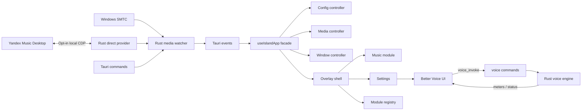

# Architecture

## Layers

## Native Layer

- `src-tauri/src/autostart`: portable Windows Run-key helper with quoted paths and single-entry refresh.
- `src-tauri/src/media`: provider arbitration, Windows `GlobalSystemMediaTransportControlsSessionManager`, health/backoff state and normalized snapshots/commands.
- `src-tauri/src/yandex`: explicit opt-in CDP discovery, renderer validation and a fixed command/state adapter for the installed desktop client.
- `src-tauri/src/config`: schema-versioned JSON config in `%APPDATA%\Music Island`.
- `src-tauri/src/window`: top-center bounds, native cursor gesture watcher, click-through state, settings / intro / already-running window lifecycle.
- `src-tauri/src/tray`: settings and quit actions.
- `src-tauri/src/logging`: local startup, protocol-health and direct-provider diagnostics.
- `src-tauri/src/updater`: **portable GitHub Releases updater** — check latest release, download `music-island.exe`, PE sanity check, replace running exe and relaunch. This is the intended forever update channel (always portable).
- `src-tauri/src/voice`: in-process Better Voice engine (capture → DSP/denoise → virtual route / VB-Cable), asset extract to `%APPDATA%\Music Island\voice\`, meters IPC.
- `src-tauri/src/plugins`: optional sidecar plugin discovery/host (legacy path; Better Voice ships in-process).
- `src-tauri/src/diagnostics`: support payload for GitHub issues.

## Frontend Layer

- `src/app/useIslandApp.ts`: stable typed facade consumed by feature UI. It composes controllers without exposing their ownership details.
- `src/app/config`: configuration loading, change subscription and persistence. Autostart is synchronized from the Rust save/startup path for portable path refresh.
- `src/app/media`: media snapshot/timeline subscriptions, local progress interpolation, session discovery, command dispatch and wave-chip state (catalog carousel disabled).
- `src/app/window`: settings-window and overlay action lifecycle.
- `src/app/tauriApi.ts`: the frontend's native adapter; native command/event details stop here.
- `src/features/overlay`: top-edge shell, native gesture events, hit-tested action controls, island update nag, animation orchestration.
- `src/features/music`: capability-driven playback, timeline and direct-provider reaction controls; optional wave chip UI.
- `src/features/settings`: live-saved layout controls, protocol health/status, Direct reconnect/consent, About/updater UI, MI | BV scope switch.
- `src/features/plugins/voice`: Better Voice settings, guide page, fox mascot, meters.
- `src/features/intro`: startup splash WebView (`intro` window label).
- `src/features/notice`: already-running notice window.
- `src/features/modules`: module contract and reserved future modules.
- `src/shared`: UI primitives (glass surface/buttons/chips), i18n, `uiPrefs`, formatting and tokens.

Dependencies point inward: `shared` does not import app or feature code, `app` does not import feature UI, and features consume app-owned state through `useIslandApp`. A lightweight check in `scripts/check-import-boundaries.mjs` enforces these constraints as part of `npm run lint`. Feature-specific native interactions may use `tauriApi` until they become facade responsibilities.

## State Model

Overlay modes: `idle`, `peek`, `compact`, `expanded`, `pinned`, `settings`, `no-session`.

The normalized `MediaSnapshot` identifies its provider (`smtc` or `yandex-direct`) and carries capability flags, timeline data, artwork, reaction state and SMTC health. The frontend does not need provider-specific command logic.

Native events are intentionally low frequency. Timeline events are compact and the UI interpolates progress locally while playback is active. The hidden Settings WebView has no media subscription or progress timer. SMTC uses active, idle, degraded and unavailable polling intervals; metadata and artwork are not re-read on every timeline probe.

The facade preserves one public state contract for both overlay and Settings windows. Passing `mediaEnabled: false` keeps the Settings WebView out of media snapshot/timeline subscriptions while retaining config, health and source-discovery behavior.

UI preferences for banners/snooze/dev previews live under `config.plugins.settings.ui` (`uiPrefs`).

## Provider lifecycle

Windows SMTC is the default provider. The configured provider is authoritative: a Direct timeout retains the last Direct state and never injects SMTC playback or commands. The inactive provider may update only independent health shown in Settings/diagnostics.

Direct Yandex is enabled only after user confirmation. Music Island first reattaches to a validated running process and loopback endpoint. Only an explicit connection action may restart the installed Electron client with a random `127.0.0.1` debugging port. A serialized actor keeps one CDP WebSocket open for state and commands. Returning to SMTC closes the debug-enabled process and launches it normally after an explicit user action.

The direct provider uses fixed selectors and commands only. It never accepts arbitrary JavaScript from the frontend, stores account tokens or creates a second playback session.

## Better Voice

Better Voice runs **inside** the Music Island process (not a required sidecar). Settings expose a Beta-scoped panel. Audio needs a Windows virtual cable (VB-Cable) so other apps can pick the processed mic. See [`BETTER_VOICE.md`](BETTER_VOICE.md).

## Module Contract

Modules are expected to provide an id, title, icon, default layout, compact renderer, expanded renderer and command list. The shell owns positioning, settings and lifecycle; modules own their content.
